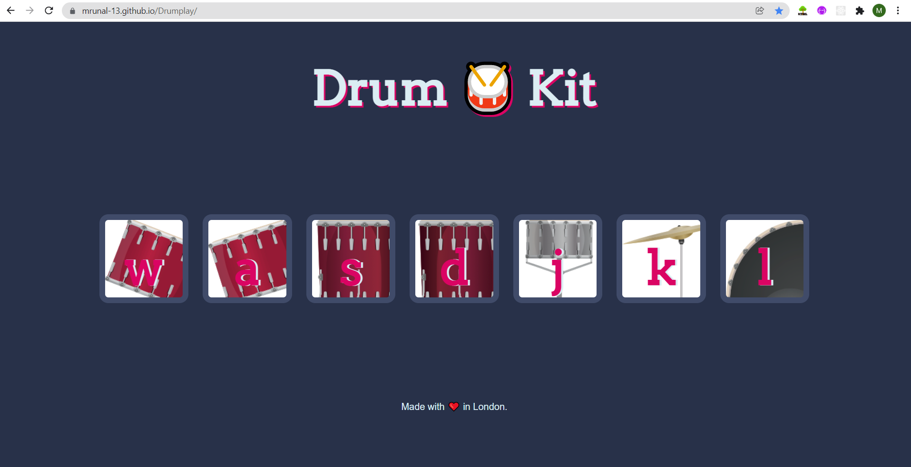

# Drumplay

### PLay your Drum here ->>> https://mrunal-13.github.io/Drumplay/

## Table of Content
1>Introduction

2>components

3>Files And Images

4>Acknowledgement

## Introduction

The drum Game also called **"Drumplay"** is a simple Web application built as beginner project.

The link to above web app is given in title of readme file.

There are four drums and other three types of musical instruments.

These instruments on clicked plays diffrent types of sounds.

The buttons to these instruments are named W,A,S,D,J,K,L.

They paly sound even on clicking the respective alphabet from keyboard.

It is really intresting o play continously and listen to the music.

## Components

The Web application is built on three diffrent languages. **HTML,JS,CSS**.

We have manipulated the classes predefined in our css code by using documnet query selector.

We divided it in two componenets 1>playsound    2>animate

The play sound function triggers the key instrument selected and creates new audio to play respective audio.

The animate function selects the key clicked or pressed and animates the instrument buttun according to class styled in css.

SETTIMEOUT function of js is used remove the animation class added to classlist so that button come backs to normal after sound is played.

The application is deployed on github pages

## Files And Images

The audio files used to give audio to each button are mentioned in audio folder.

The images used in each buttun are provided in image folder.

The Web app looks alike:-

## Acknowledgement

I enjoyed creating this project very much.I would deeply like to thank my teacher and instructor angela yhu for motivating me and teaching me required skills for this simple beginner project.

**Thank You .....**

See you soon in Next repo with some diffrent project !

@Mrunal Nimbalkar
